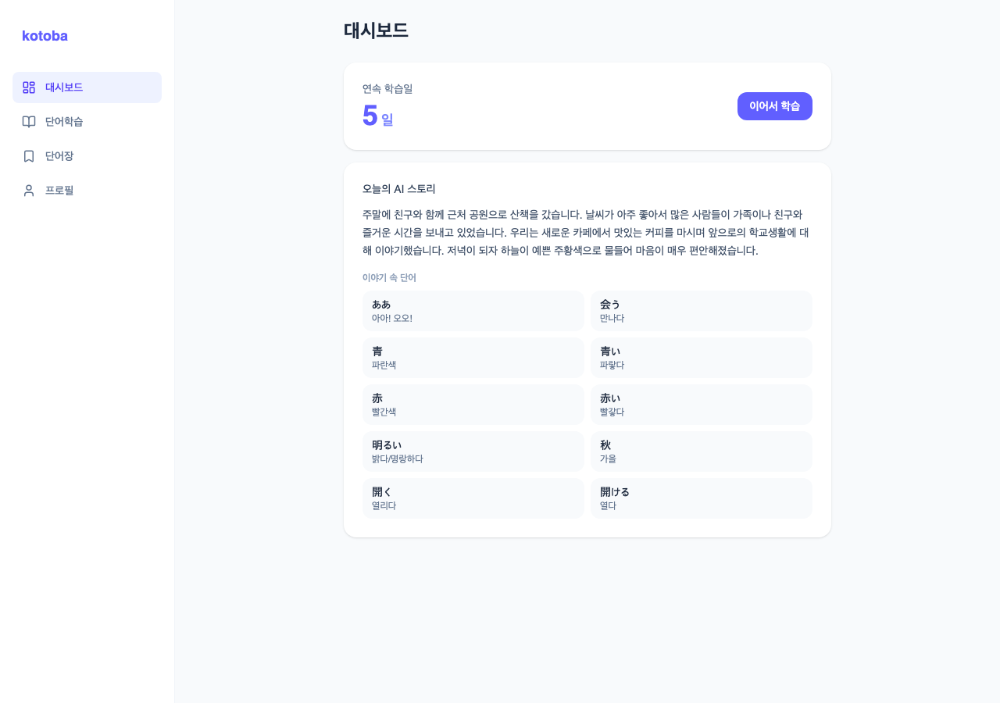
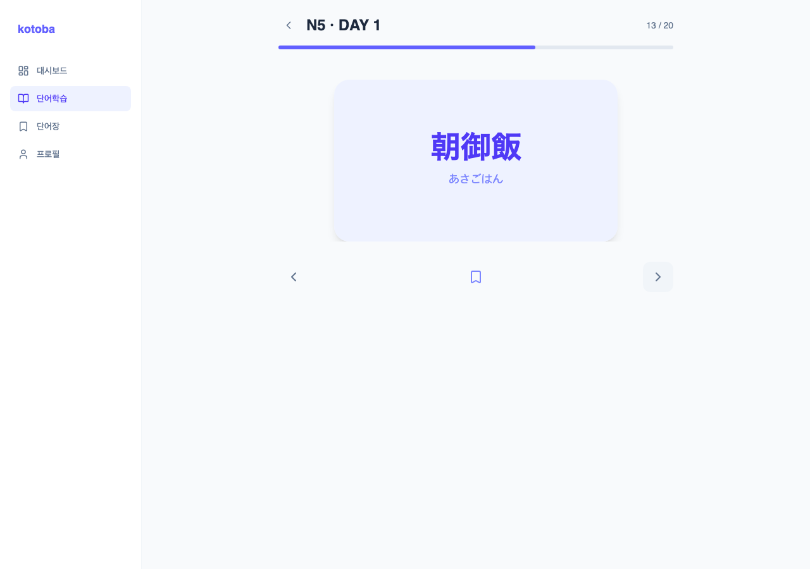
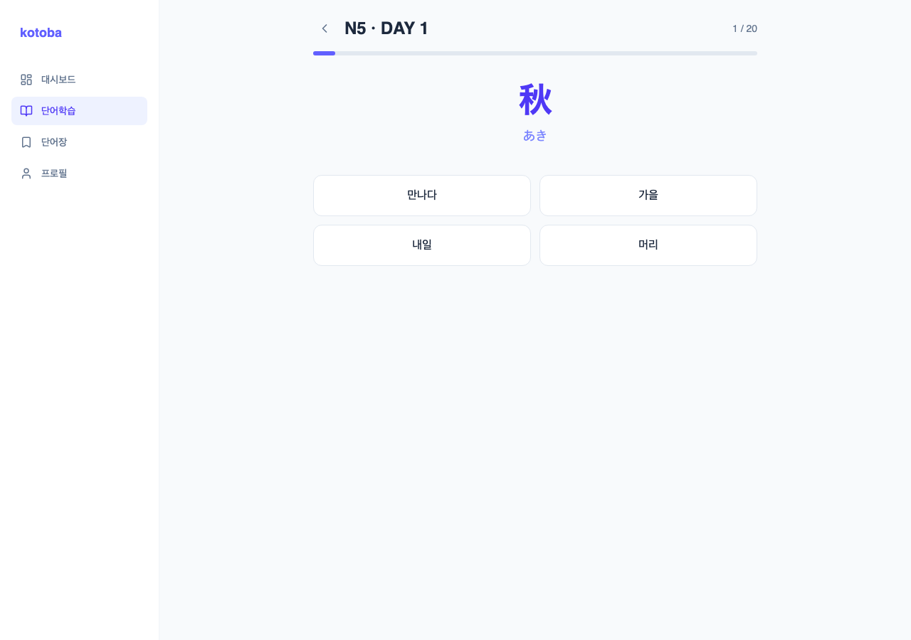
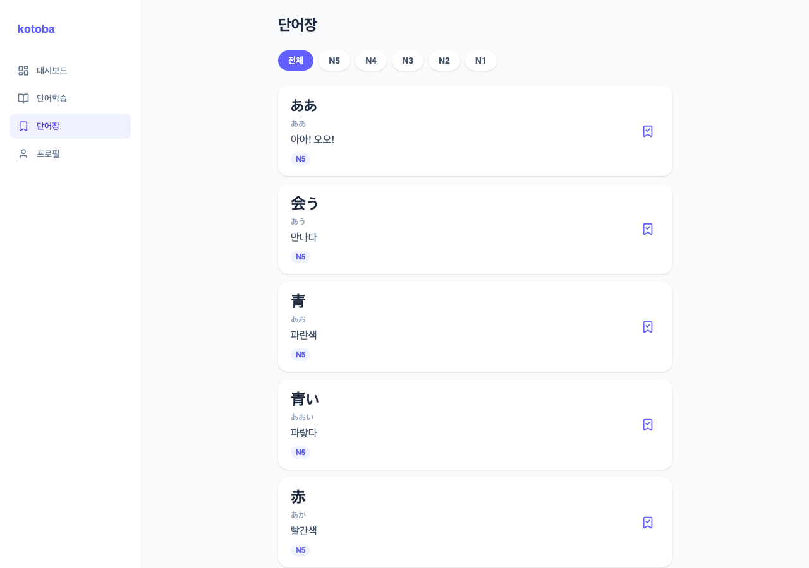

# kotoba-web

[kotoba-ai](https://github.com/the-hana/kotoba-infra) の React フロントエンド。日本語 → 韓国語 AI 単語帳アプリ。

関連リポジトリ: [kotoba-api](https://github.com/the-hana/kotoba-api)（Rails API） / [kotoba-infra](https://github.com/the-hana/kotoba-infra)（Terraform AWSインフラ）

**Live**: https://dlxlfjdqep5lt.cloudfront.net

| ダッシュボード | フラッシュカード | クイズ | 単語帳 |
|---|---|---|---|
|  |  |  |  |

## 技術スタック

- React 19 / TypeScript / Vite / TailwindCSS 4
- React Router
- axios

## 画面構成

| 画面 | 内容 |
|---|---|
| ダッシュボード | 連続学習日数 + 続きから学習ボタン + 今日のAIストーリーカード |
| 単語学習 | レベル選択 → DAY一覧 → 単語一覧 → フラッシュカード / クイズ |
| 単語帳 | ブックマークした単語一覧（レベルフィルタ付き） |
| プロフィール | ニックネーム変更・目標レベル変更・ログアウト・退会 |

モバイルは下部タブナビゲーション、デスクトップはサイドバーナビゲーション。

## セットアップ

### 前提条件

- Node.js
- pnpm
- [kotoba-api](https://github.com/the-hana/kotoba-api)（ローカルで起動しておくか、`VITE_API_BASE_URL` で本番APIを指す）

### 実行

```bash
pnpm install
pnpm dev
```

### ビルド・Lint

```bash
pnpm build   # dist/ に出力
pnpm lint
```

### 環境変数

| 変数名 | 説明 |
|---|---|
| `VITE_API_BASE_URL` | kotoba-api のベースURL |

## API 連携

- access token はメモリ保管、refresh token は localStorage に保存（`authStore.ts`, zustand persist）
- 全リクエストに `Authorization: Bearer <token>` ヘッダーを付与
- レスポンス形式: `{ success, data, error }`
- API 呼び出しは `src/api/` 配下にドメイン別で集約

## コーディング規約

- コンポーネント: PascalCase、Named export のみ（default export 禁止）
- インライン `style={{}}` は原則禁止 — Tailwind クラスを使用（CSS変数注入など例外あり、例: `FlashCardPage.tsx` のプログレスバー）

## デプロイ

GitHub Actions → `pnpm build` → S3 sync → CloudFront invalidation（[kotoba-infra](https://github.com/the-hana/kotoba-infra) 参照）
